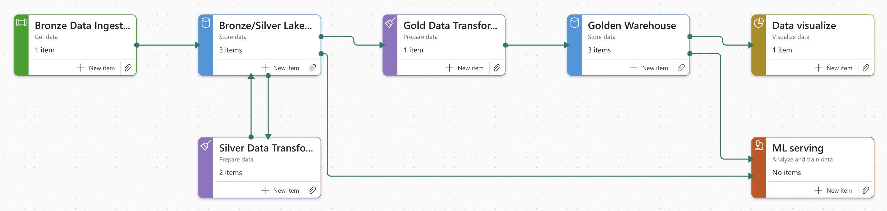

# **Olist E-commerce BI with Microsoft Fabric**
#### *Delivery, Revenue & Customer Insights Project*

An end-to-end retail analytics pipeline built in **Microsoft Fabric** using the public **Olist Brazilian E-commerce Dataset**. This project simulates real-world Business Intelligence workflows from raw data ingestion to data modeling, cleaning, and preparation for Power BI dashboards, focusing on **delivery performance**, **revenue optimization**, and **customer satisfaction**.

---

## 📦 Dataset
- **Source:** [Brazilian E-Commerce Public Dataset by Olist](https://www.kaggle.com/datasets/olistbr/brazilian-ecommerce)
- +100,000 orders, with tables for orders, products, customers, sellers, reviews, payments, geolocation, and more
- Real-world use case: Multi-vendor marketplace in Brazil

## 🎯 Business Problem
How can an e-commerce platform improve delivery efficiency, increase revenue, and enhance customer satisfaction?

This project explores multiple business domains:
- Sales performance and revenue trends
- Delivery delays and operational bottlenecks
- Customer satisfaction and churn analysis
- Product and category-level returns
- Geographic variation in performance

## 🔧 Tools & Technologies
| Layer                | Tools Used                                           |
|----------------------|------------------------------------------------------|
| Storage & Ingestion  | **OneLake (Microsoft Fabric)**                       |
| Data Modeling        | **Lakehouse**, **Warehouse (SQL Endpoint)**          |
| Transformation       | **Notebooks (PySpark)**, **SQL (Fabric Warehouse)**  |
| BI Visualization     | *Power BI* (under implementation)                    |
| Languages            | SQL, PySpark                                         |

## 🏗️ Medallion Architecture in This Project

This project follows the **Bronze → Silver → Gold** medallion pattern, a best practice for data engineering:

- **Bronze (Raw Layer):**  
  Direct ingestion of the raw `.csv` files into the Lakehouse with minimal processing.  
  Goal: Preserve source data as-is for traceability.

- **Silver (Clean Layer):**  
  Data cleaning, standardization, and joining across tables using **PySpark notebooks** and **SQL scripts**.  
  Goal: Improve data quality, enforce consistent formats, and create conformed dimensions.

- **Gold (Curated Layer):**  
  Modeled star schema stored in **Fabric Warehouse** with fact and dimension tables (`fact_orders`, `dim_customer`, etc.).  
  Goal: Provide business-friendly, analytics-ready data for dashboards and KPIs.

## 🔄 Data Pipeline Flow

Below is the high-level data pipeline implemented in Microsoft Fabric:

1. **CSV Files → OneLake (Bronze)**  
   Raw data ingestion into Lakehouse.

2. **Lakehouse → PySpark / SQL (Silver)**  
   Cleaning, standardization, and intermediate modeling.

3. **Silver → Warehouse (Gold)**  
   Curated star schema built for analytics.

4. **Warehouse → Power BI**  
   Semantic model and dashboards for business insights.

📌 *Implemented Pipeline Diagram*  

> 🧩 *Planned extension*: leverage the Gold layer for ML serving (predicting delivery delays, churn risk).

## 📊 Planned Dashboards (Coming Soon)
- Sales Overview
- Delivery Performance
- Customer Satisfaction
- Product & Category Insights
- Regional Analysis
- Executive Summary

## 🔍 Initial Insights (to be expanded after visualization phase)
- Some orders show delivery dates occurring later than estimated, suggesting potential delay patterns.
- Customer review scores appear linked to delivery performance, but this requires deeper validation.
- Revenue distribution is skewed toward certain product categories, hinting at concentration risk.

👉 These observations will be confirmed and quantified in the reporting phase.

## 📁 Folder Structure
<pre lang="text">
fabric-bi-olist-ecommerce-analytics/
│
├── data/                       # Raw CSV files
├── docs/                       # Support documentation
├── notebooks/                  # PySpark Notebook to perform the bronze to silver transformations
├── pipelines/                  # Data pipelines to automatize data ingestion and transformation
├── reports/                    # Power BI report (under implementation)
├── sql/                        # SQL scripts for Warehouse modeling (silver to gold transformations)
│
├── .gitignore
├── dataset_map.json            # JSON file containing metadata to automate the data ingestion
└── README.md                   # This file
</pre>

---

## 📬 Contact

Marcus Fernandes – Data & Business Intelligence Analyst | Toronto  
[LinkedIn](https://www.linkedin.com/in/marcusfsv) • [GitHub](https://www.github.com/marcusfsv)